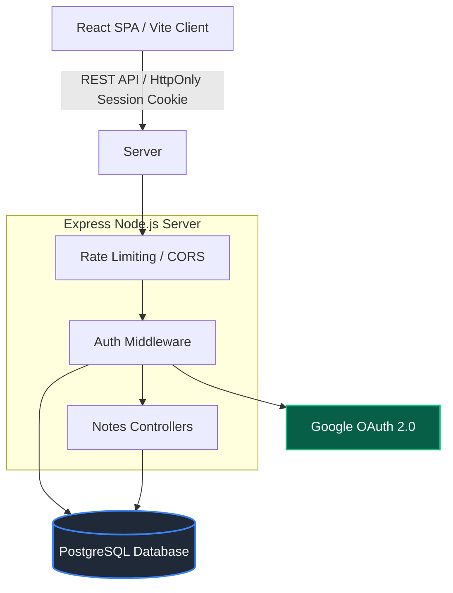

<div align="center">
  <h1>📝 QuickNotes</h1>
  <p><em>Your thoughts, organized beautifully and securely.</em></p>

  [](https://quicknotes-116e.onrender.com)
  [](https://reactjs.org/)
  [](https://nodejs.org/)
  [](LICENSE)
  [](.github/workflows/ci.yml)
</div>

---

## ✨ Features

- **Google OAuth Integration:** Secure, passwordless login using your Google account.
- **Real-Time Organization:** Tag, categorize, and pin notes dynamically.
- **Security First:** Implements CSRF protection, Helmet headers, rate limiting, and parameterization to guard against injection.
- **Lightning Fast UI:** Built on Vite + React 18, utilizing local state optimizations and optimistic updates.
- **Responsive Design:** A beautiful, responsive interface that works flawlessly across all devices.

---

## 🛠️ Tech Stack

| Domain | Technology |
| :--- | :--- |
| **Frontend** | React 18, Vite, React Router DOM, Custom CSS |
| **Backend** | Node.js, Express, PostgreSQL (`pg`) |
| **Authentication** | Google OAuth2 (`google-auth-library`), Secure HttpOnly Cookies |
| **Security** | Helmet, CORS, Express-Rate-Limit, SQL Parameterization |
| **Testing & CI**| Vitest, Supertest, GitHub Actions |

---

## 🏗️ Architecture



---

## 📂 Folder Tree

```text
Quicknotes/
├── client/                      # React frontend
│   ├── public/                  # Static assets
│   ├── src/                     # React source code
│   │   ├── auth/                # Auth context and protected routes
│   │   ├── components/          # Reusable UI components
│   │   ├── pages/               # Page views
│   │   ├── services/            # API services and fetch wrappers
│   │   └── styles/              # Global and scoped CSS
│   └── vite.config.js           # Vite configuration
│
├── server/                      # Express backend
│   ├── src/                     # API source code
│   │   ├── auth.js              # OAuth and session management
│   │   ├── db.js                # PostgreSQL connection pool
│   │   ├── index.js             # Express entry point
│   │   ├── migrate.js           # DB schema migration script
│   │   ├── notes.js             # Notes API controllers
│   │   └── schema.sql           # Database schema
│   └── tests/                   # API Integration Tests
│
├── .github/workflows/           # CI/CD pipelines
├── package.json                 # Root monorepo configuration
├── render.yaml                  # Render deployment configuration
└── .env.example                 # Environment variables template
```

---

## 📸 Screenshots

*(Add actual screenshots in `docs/screenshots/`)*


*The beautifully designed dashboard where you manage your thoughts.*


*The distraction-free note editor interface.*

---

## 🚀 Local Setup

### Prerequisites
- Node.js v20.6.0+
- PostgreSQL database
- Google OAuth Client ID and Secret

### Installation

1. **Clone the repository:**
   ```bash
   git clone https://github.com/chetanaybuilder/Quicknotes.git
   cd Quicknotes
   ```

2. **Configure Environment:**
   Copy `.env.example` to `.env` and fill in your credentials.

3. **Install Dependencies:**
   ```bash
   npm run install:all
   ```

4. **Initialize Database:**
   ```bash
   npm run db:migrate
   ```

5. **Run Development Servers (Client + Server):**
   ```bash
   npm run dev
   ```
   Navigate to `http://localhost:5173`.

---

## 🔒 Environment Variables

| Variable | Description |
| :--- | :--- |
| `NODE_ENV` | `development` or `production` |
| `PORT` | API Port (default `8787`) |
| `DATABASE_URL` | PostgreSQL connection string |
| `GOOGLE_CLIENT_ID` | OAuth2 Client ID from Google Cloud Console |
| `GOOGLE_CLIENT_SECRET` | OAuth2 Client Secret |
| `APP_URL` | Frontend URL (used for CORS and OAuth redirects) |

---

## 📜 Scripts Reference

- `npm run install:all`: Installs both client and server dependencies.
- `npm run dev`: Runs Vite (client) and Nodemon (server) concurrently.
- `npm run build`: Builds the React client for production.
- `npm start`: Starts the production Express server serving the static build.
- `npm run lint`: Runs ESLint across the monorepo.
- `npm run format`: Formats code via Prettier.
- `npm run test`: Executes Vitest and Supertest suites.

---

## 🌐 API Endpoint Reference

| Method | Endpoint | Authenticated | Description |
| :--- | :--- | :---: | :--- |
| `GET` | `/api/auth/google` | ❌ | Initiates OAuth flow |
| `GET` | `/api/auth/google/callback` | ❌ | OAuth callback URL |
| `GET` | `/api/auth/me` | ✅ | Returns current session user |
| `POST`| `/api/auth/logout` | ✅ | Destroys current session |
| `GET` | `/api/notes/` | ✅ | Fetch all notes (max 2000) |
| `POST`| `/api/notes/` | ✅ | Create a new note |
| `PATCH`| `/api/notes/:id` | ✅ | Update an existing note |
| `DELETE`| `/api/notes/:id` | ✅ | Delete a note |

---

## ☁️ Deployment (Render)

This repository includes a `render.yaml` configuration which defines the full-stack web service and managed PostgreSQL instance.

1. Connect the repository to Render.
2. Select **New > Blueprint** and attach the repo.
3. Supply `GOOGLE_CLIENT_ID` and `GOOGLE_CLIENT_SECRET` as environment variables in the Render dashboard.
4. Render automatically runs `npm run install:all`, followed by `npm run build` and uses `npm start` for the startup command!

---

## 🛡️ Security Notes

- **CSRF:** Evaluated securely on the API level by strictly checking the origin of any state-changing `POST/PATCH/DELETE` request.
- **SQL Injection:** Absolutely zero string concatenation; `pg` parameterized querying (`$1`, `$2`) is mandated everywhere.
- **Session:** Purely server-side HttpOnly, SameSite=Lax standard. Tokens are securely hashed using `sha256` before hitting the database.

---

## 🗺️ Roadmap & Contributing

Please refer to [CONTRIBUTING.md](CONTRIBUTING.md) and [SECURITY.md](SECURITY.md) for detailed policies before opening a pull request.

- [ ] Add rich text editor support.
- [ ] Implement Redis for advanced rate limiting in multi-node setups.
- [ ] Multi-language i18n support.

---

**Author:** [chetanaybuilder](https://github.com/chetanaybuilder)
